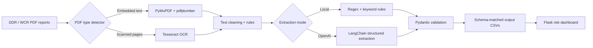
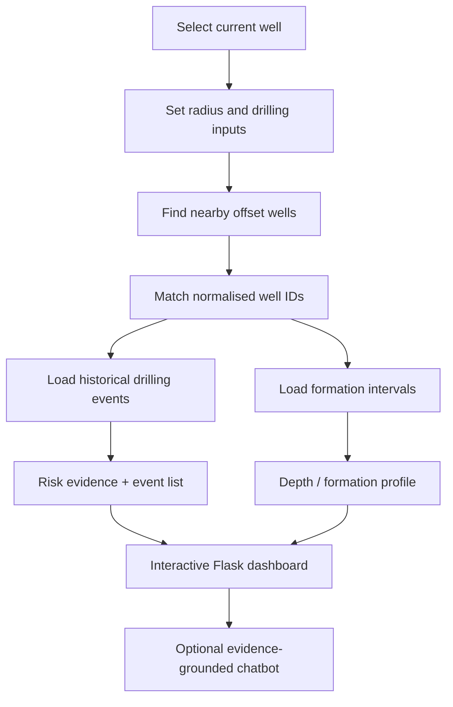
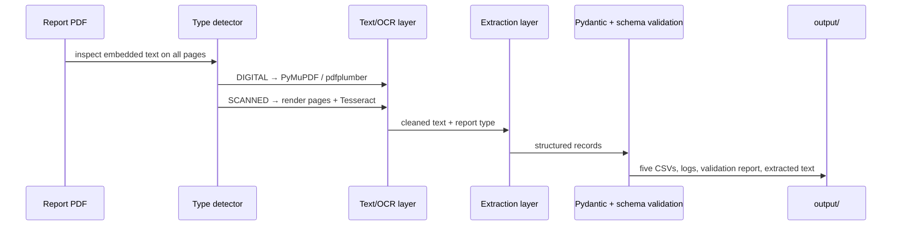

# NWIS — Oil & Gas Offset-Well Risk Intelligence

[](https://www.python.org/)
[](https://flask.palletsprojects.com/)
[](https://platform.openai.com/)
[](#)

**NWIS** turns drilling-report evidence and nearby offset-well history into a practical drilling-risk workspace. It processes digital and scanned DDR/WCR PDF reports, keeps output compatible with the existing synthetic datasets, and presents the evidence in an interactive Flask dashboard.

> The dashboard is decision support, not a replacement for approved drilling procedures or engineering review.



For an editable version of this workflow, open [workflow.drawio](workflow.drawio) in [diagrams.net](https://app.diagrams.net/).

## What it does

| Capability | Outcome |
| --- | --- |
| Offset-well intelligence | Finds wells within a selected radius using `geopy` distance calculations. |
| Historical risk evidence | Shows nearby drilling events, severity, depth, formation and operational impact. |
| Depth visualisation | Compares formation intervals and events across the current and offset wells. |
| Risk indication | Uses drilling parameters, formation and offset evidence to classify risk. |
| Report links | Opens DDR/WCR PDFs that correspond to a nearby well when available. |
| Evidence-grounded assistant | Answers questions from the currently selected well and offset-event context. |
| PDF ingestion | Automatically selects text extraction or OCR and writes validated CSV output. |

## Tools used

| Area | Tools |
| --- | --- |
| Web interface | [](https://flask.palletsprojects.com/) HTML, CSS and JavaScript |
| Data and ML | [](https://pandas.pydata.org/) [](https://numpy.org/) [](https://scikit-learn.org/) |
| Maps and charts | [](https://python-visualization.github.io/folium/) [](https://www.openstreetmap.org/) [](https://altair-viz.github.io/) |
| PDF and OCR | [](https://pymupdf.readthedocs.io/) [](https://github.com/tesseract-ocr/tesseract) [](https://python-pillow.org/) |
| AI extraction and assistant | [](https://python.langchain.com/) [](https://platform.openai.com/) |
| Validation and matching | [](https://docs.pydantic.dev/) [](https://rapidfuzz.github.io/RapidFuzz/) |

## Project layout

```text
spaceX/
├── Dashboard.py                 # Flask dashboard and risk model
├── extract_report.py            # PDF-to-structured-data pipeline
├── drill_events.py              # Offset-well event analysis utilities
├── datasets/                    # Unmodified synthetic reference datasets
│   ├── wells.csv
│   ├── well_formations.csv
│   ├── formations.csv
│   ├── drilling_parameters.csv
│   └── drilling_events.csv
├── data/                        # Input reports, searched recursively
│   ├── reports/                 # Digital PDFs
│   └── scanned_reports/         # Scanned PDFs
├── templates/dashboard.html     # Flask dashboard template
├── static/                      # Dashboard CSS and browser JavaScript
├── output/                      # Generated reports and CSVs (git-ignored)
├── workflow.drawio              # Editable workflow diagram
├── skills.md                    # Skills and component guide
└── requirements.txt
```

## Dashboard workflow



### Dashboard features

- **Map:** current well in green; nearby wells in blue; wells with matching risk evidence in red.
- **Historical events:** a fixed-height, scrollable panel keeps the layout compact.
- **Depth profile:** formation intervals and event locations are plotted by measured depth. The dashed green line is the selected current depth.
- **Relevant reports:** links open a matching DDR or WCR PDF from `data/` when it exists.
- **Chatbot:** only enabled when `OPENAI_API_KEY` is present. It receives the selected well, visible offsets, historical events and current risk context; it is instructed not to invent missing facts.

## Data contract

`datasets/` is the source of truth and is never overwritten. The extractor reads these CSV headers at runtime, validates extracted rows, adds missing columns as null, removes unexpected columns, normalises types, and writes the results to `output/` in identical column order.

| Output file | Purpose |
| --- | --- |
| `wells.csv` | Well identity, location, field and depth information |
| `well_formations.csv` | Formation top/bottom intervals per well |
| `formations.csv` | Canonical formation reference records |
| `drilling_parameters.csv` | Depth-indexed mud weight, ROP, RPM and WOB |
| `drilling_events.csv` | Historical drilling incident evidence |

Well IDs are normalised only in helper columns for matching. The original CSV key values are preserved. Formation names are matched against the canonical formation dataset where possible.

## Installation

1. Create and activate a virtual environment (Windows PowerShell):

   ```powershell
   py -m venv venv
   .\venv\Scripts\Activate.ps1
   ```

2. Install the Python dependencies:

   ```powershell
   python -m pip install --upgrade pip
   pip install -r requirements.txt
   ```

3. Optional: create `.env` in the project root for the chatbot/OpenAI extraction.

   ```env
   OPENAI_API_KEY=your_api_key_here
   OPENAI_CHAT_MODEL=gpt-4o-mini
   FLASK_SECRET_KEY=replace-with-a-long-random-secret
   ```

   Do not commit `.env`. Local PDF extraction works without an OpenAI key.

### Tesseract setup for scanned reports (Windows)

Tesseract is an operating-system installation, separate from `pytesseract`.

1. Install Tesseract OCR (for example, the Windows installer from the [UB Mannheim Tesseract builds](https://github.com/UB-Mannheim/tesseract/wiki)).
2. The extractor automatically checks:

   ```text
   C:\Program Files\Tesseract-OCR\tesseract.exe
   C:\Program Files (x86)\Tesseract-OCR\tesseract.exe
   ```

3. If it is installed elsewhere, add this to `.env` and restart the command:

   ```env
   TESSERACT_CMD=C:\path\to\Tesseract-OCR\tesseract.exe
   ```

4. Verify the installation:

   ```powershell
   & "C:\Program Files\Tesseract-OCR\tesseract.exe" --version
   ```

## Run the dashboard

```powershell
.\venv\Scripts\python.exe Dashboard.py
```

Open **http://127.0.0.1:5000** in your browser. The map uses public OpenStreetMap tiles and requires no CARTO API key.

## Process reports

The extractor searches `data/` recursively, determines each PDF type automatically, and continues even if an individual report fails.

```powershell
# API-free extraction: recommended for a first run
.\venv\Scripts\python.exe extract_report.py --mode local

# Automatic: OpenAI structured extraction when OPENAI_API_KEY exists,
# otherwise the local deterministic extractor
.\venv\Scripts\python.exe extract_report.py --mode auto

# Require OpenAI structured extraction
.\venv\Scripts\python.exe extract_report.py --mode openai
```

Custom paths are supported:

```powershell
.\venv\Scripts\python.exe extract_report.py --input .\data --dataset .\datasets --output .\output --mode local
```

### PDF processing path



### Generated output

```text
output/
├── wells.csv
├── well_formations.csv
├── formations.csv
├── drilling_parameters.csv
├── drilling_events.csv
├── validation_report.json
├── processing_log.json
└── extracted_text/
    └── <report-name>.txt
```

`processing_log.json` contains one entry per PDF, including its PDF/report type, OCR use, extraction mode, status and warnings. `validation_report.json` contains invalid records, warnings, missing fields and corrections.

## Extraction modes

| Mode | API key | Behaviour |
| --- | --- | --- |
| `local` | Not required | Deterministic regex, keyword, section and reference-data matching. |
| `auto` | Optional | Uses LangChain/OpenAI when a key is available; otherwise local mode. |
| `openai` | Required | Uses LangChain structured output with Pydantic models. Fails clearly if the key or packages are absent. |

The extractor does not use reference data to invent report facts. Unavailable fields remain null.

## Quick validation checklist

- Run `python extract_report.py --mode local` with one digital PDF in `data/reports/`.
- Run it with one scanned PDF in `data/scanned_reports/` after verifying Tesseract.
- Confirm five CSVs appear in `output/` and their columns match `datasets/`.
- Confirm `output/extracted_text/`, `processing_log.json` and `validation_report.json` were created.
- Start `Dashboard.py`, select a well, adjust depth/radius, and open a relevant-report link.
- Add `OPENAI_API_KEY` only if you want the dashboard assistant or OpenAI extraction mode.

## Development notes

- Keep `datasets/` unchanged; it is both schema definition and reference data.
- Keep secrets in `.env`; `.gitignore` excludes `.env`, Python cache files and `output/`.
- The default Flask server is for local development. Configure a production WSGI server and a strong `FLASK_SECRET_KEY` before deployment.
- The dashboard's risk model is trained from the provided synthetic drilling-parameter and event data at application startup.
